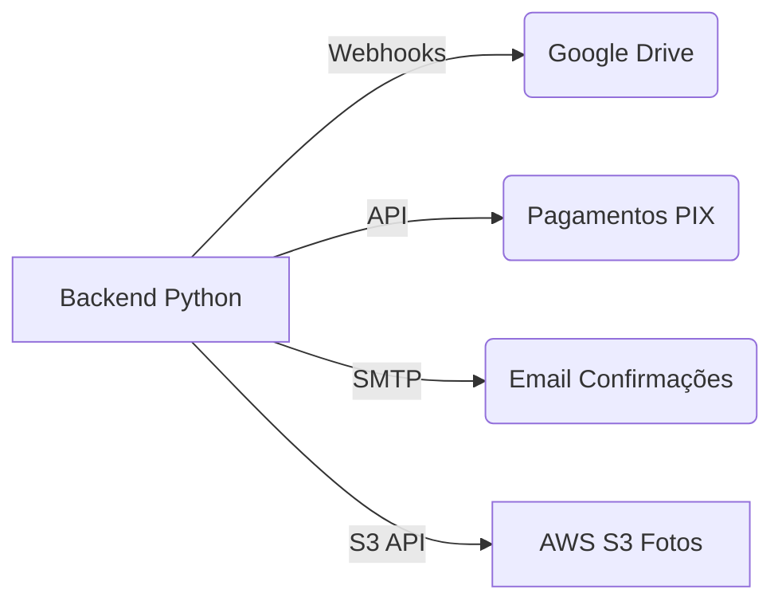

### Descrição para Repositório do App de Organização de Casamentos  

---

**Nome do Projeto**: **WeddingPlanner**  
**Descrição**: Uma plataforma web completa para organização de casamentos, conectando noivos, convidados e equipe de recepção com ferramentas intuitivas para gestão do evento.  

---

### ✨ Recursos Principais  

#### 👰 **Área dos Noivos (Login Protegido)**  
- **Cadastro de Convidados**: Nome (obrigatório) + telefone (opcional)  
- **Editor de Convites**: Textos personalizados com placeholders `[nome]` + links de vídeo (YouTube/Vimeo)  
- **Linha do Tempo Interativa**:  
  - Eventos com datas, textos, fotos e vídeos  
  - Layout com linha central e elementos alternados (+ responsivo)  
- **Lista de Presentes Virtuais**:  
  - Presentes fictícios (imagem, título, valor)  
  - Integração com PIX (QR Code ou chave copiável)  
- **Dashboard de Confirmações**:  
  - Gráficos de % de confirmados vs. pendentes  
  - Lista filtrada por status  
- **Álbum de Fotos Compartilhado**:  
  - Vinculação com Google Drive/Microsoft OneDrive  
  - Opção de upload direto (via API)  

#### 📱 **Interface do Convidado (Sem Login)**  
- **Convite Personalizado**:  
  - Mensagem dinâmica com nome do convidado + botão de confirmação  
- **Menu Principal**:  
  - 📜 Linha do Tempo dos Noivos (história multimídia)  
  - 🕒 Cronograma do Evento (ordem de atividades + dress code)  
  - 🎁 Lista de Presentes (seleção + simulação de pagamento via PIX)  
  - 📸 Desafios Fotográficos (checklist + upload para álbum)  
- **Contagem Regressiva**:  
  - "Faltam [XX] dias!" destacado no cabeçalho  

#### 🎫 **Painel do Recepcionista (Acesso via Link Especial)**  
- Busca instantânea de convidados  
- Geração de QR Code individual para check-in  
- Marcação automática de presença  

---

### 🛠 Stack Tecnológica  
| Área          | Tecnologias                                                                 |
|---------------|-----------------------------------------------------------------------------|
| **Frontend**  | React.js + TypeScript, Tailwind CSS, Framer Motion                         |
| **Backend**   | **FastAPI**, PostgreSQL, Celery (para tarefas assíncronas) |
| **Autenticação** | JWT (FastAPI)                                      |
| **Cloud**     | AWS S3, Google Drive API                                                   |
| **Bibliotecas Python** | `Pillow` (imagens), `qrcode`, `celery`, `pydantic` (FastAPI), |
| **DevOps**    | Docker, GitHub Actions, Nginx                                              |

---

### ⚙️ Como Executar Localmente

```bash
# Backend
cd backend/fastapi
python -m venv venv
source venv/bin/activate
pip install -r requirements.txt
uvicorn main:app --reload

# Frontend
cd frontend
npm install
npm run dev
```

---

### 📂 Estrutura de Diretórios  
```markdown
weddingplanner/
├── backend/
│   └── fastapi/
│       ├── app/
│       │   ├── core/          # Configurações
│       │   ├── auth/          # Autenticação JWT
│       │   ├── models/        # Modelos Pydantic
│       │   ├── crud/          # Operações DB
│       │   ├── routes/        # Endpoints
│       │   │   ├── wedding.py # Rotas dos noivos
│       │   │   ├── guests.py  # Rotas convidados
│       │   │   └── ...
│       ├── migrations/        # Alembic migrations
│       └── main.py            # Ponto de entrada
│
├── frontend/
│   ├── public/
│   └── src/
│       ├── components/   # UI reutilizável
│       ├── pages/        # Telas principais
│       │   ├── Admin/    # Painel dos noivos
│       │   ├── Guest/    # Interface convidado
│       │   └── Reception # Painel recepcionista
│       ├── contexts/     # Gestão de estado (Auth, Convidados)
│       └── services/     # Chamadas API
│
└── docker-compose.yml    # Configuração Docker
```

---

### 🌟 Diferenciais  
- **Privacidade Garantida**: Links únicos por convidado (sem exposição pública)  
- **Otimizado para Mobile**: PWA com suporte offline para áreas do evento  
- **Zero Configuração**: Recepcionista acessa via link direto (sem login)  
- **Integração Pix Instantânea**: Geração automática de QR Codes para presentes  

---

#### **Recursos Comuns**:
- Geração de QR Codes com `qrcode`
- Upload seguro de imagens com verificação
- Integração PIX via endpoints dedicados
- Sincronização com Google Drive API

---

### 🔐 Segurança
- Validação rigorosa de dados com Pydantic (FastAPI)
- Rate limiting para endpoints públicos
- Criptografia de dados sensíveis
- Tokens JWT com expiração curta

---

### 🌐 Integrações


---

### ✅ Pré-requisitos
- Python 3.10+
- PostgreSQL 14+
- Node.js 18+ (frontend)

---

### 📄 Licença  
Sem licença  


> ✨ "Transformando momentos especiais em experiências digitais inesquecíveis"